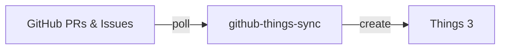

# github-things-sync

Sync GitHub PRs and Issues to Things 3 on macOS.



## Features

- **PR Review Requests** → Task appears in Today
- **PRs you created** → Track your open PRs
- **Issues assigned to you** → Never miss an assignment
- **Issues you created** → Track your reported issues
- **Auto-close** → Tasks complete when PRs merge or Issues close

## Installation

```bash
git clone https://github.com/moto-nrw/github-things-sync.git
cd github-things-sync
npm install && npm run build && npm install -g .
```

## Quick Start

```bash
# 1. Setup
github-things-sync init

# 2. Start daemon
github-things-sync start

# Done! Tasks appear in Things under "GitHub" project
```

## Commands

| Command | Description |
|---------|-------------|
| `init` | Setup wizard |
| `start` | Start background daemon |
| `stop` | Stop daemon |
| `status` | Show sync status |
| `sync` | Manual one-time sync |
| `config` | View/edit settings |
| `config --verify` | Test your tokens |

## Requirements

- macOS
- Things 3 (with URL Scheme enabled)
- Node.js 18+
- [GitHub Token](https://github.com/settings/tokens) with `repo` scope

## Documentation

- [Configuration & Options](docs/CONFIG.md)
- [Architecture & How It Works](docs/ARCHITECTURE.md)
- [Troubleshooting](docs/TROUBLESHOOTING.md)

## License

MIT
