# github-things-sync

Sync GitHub PRs and Issues to Things 3 on macOS. Automatically creates tasks when you're assigned to issues or requested for PR reviews, and closes them when the GitHub item is resolved.

## Features

- **PR Review Requests** → Task "Review: [PR Title]" appears in Today
- **PRs you created** → Task "PR: [PR Title]" with status tracking
- **Issues assigned to you** → Task "Issue: [Title]"
- **Issues you created** → Task "My Issue: [Title]"
- **Auto-close** → Tasks complete automatically when PRs are merged or Issues closed
- **Runs as daemon** → Polls GitHub, starts automatically on login
- **Configurable** → Adjust poll interval, project name, tokens via CLI

## Installation

```bash
# Clone and install globally
git clone https://github.com/yungweng/github-things-sync.git
cd github-things-sync
npm install
npm run build
npm install -g .
```

## Quick Start

```bash
# 1. Setup (creates config, installs LaunchAgent for autostart)
github-things-sync init

# 2. Start the daemon
github-things-sync start

# That's it! Tasks will appear in Things under "GitHub" project + Today
```

## CLI Commands

| Command | Description |
|---------|-------------|
| `github-things-sync init` | Interactive setup wizard |
| `github-things-sync start` | Start the background daemon |
| `github-things-sync stop` | Stop the daemon |
| `github-things-sync status` | Show sync status and recent activity |
| `github-things-sync sync` | Run a single sync (no daemon) |
| `github-things-sync sync -v` | Run sync with verbose output |
| `github-things-sync config` | View current settings |
| `github-things-sync config --verify` | Verify tokens work |
| `github-things-sync config --interval=120` | Set poll interval (seconds) |
| `github-things-sync config --autostart=false` | Disable autostart |
| `github-things-sync config --project=Work` | Change Things project |

## Config Options

```bash
# View current config
github-things-sync config

# Verify tokens are valid
github-things-sync config --verify

# Change poll interval (minimum 60 seconds)
github-things-sync config --interval=120

# Enable/disable autostart on login
github-things-sync config --autostart=true
github-things-sync config --autostart=false

# Change Things project name
github-things-sync config --project="My Project"

# Update tokens (interactive)
github-things-sync config --github-token=prompt
github-things-sync config --things-token=prompt
```

## Architecture

```mermaid
flowchart TB
    subgraph mac["🖥️ Your Mac"]
        subgraph app["github-things-sync"]
            CLI["**CLI**\ninit · start · stop\nstatus · sync · config"]
            Daemon["**Daemon**\nPolls every X seconds"]
            State[("**State**\nconfig.json\nstate.json")]
        end
        Things["**Things 3**\n📋 Tasks in Project\n⭐ Appears in Today"]
    end

    GitHub["**GitHub**\n🔀 Pull Requests\n🎫 Issues"]

    CLI --> Daemon
    Daemon <--> State
    Daemon -->|"AppleScript\n+ URL Scheme"| Things
    Daemon <-->|"REST API\n(Octokit)"| GitHub

    style mac fill:#1a1a2e,stroke:#16213e,color:#fff
    style app fill:#16213e,stroke:#0f3460,color:#fff
    style Things fill:#4a69bd,stroke:#1e3799,color:#fff
    style GitHub fill:#24292e,stroke:#444,color:#fff
```



### Data Flow


### How It Works

1. **Daemon polls GitHub** for your open PRs and Issues
2. **New items** → Creates task in Things via AppleScript (gets task ID) + sets to Today via URL Scheme
3. **Closed items** → Completes task in Things via URL Scheme
4. **State tracked** in `~/.github-things-sync/state.json` to avoid duplicates

### GitHub Queries

- `is:pr is:open review-requested:@me` → PR review requests
- `is:pr is:open author:@me` → PRs you created
- `is:issue is:open assignee:@me` → Issues assigned to you
- `is:issue is:open author:@me` → Issues you created

## Requirements

- macOS (Things 3 is macOS only)
- Things 3 with URL Scheme enabled
- Node.js 18+
- GitHub Personal Access Token with `repo` scope

## Setup Details

### GitHub Token

Create a [Personal Access Token](https://github.com/settings/tokens) with `repo` scope.

### Things Auth Token

Required for updating/completing tasks. Find it in:
Things → Settings → General → Things URLs → Manage

### Things Project

Create a project called "GitHub" in Things (or use `--project` to specify a different name).

## File Locations

| File | Purpose |
|------|---------|
| `~/.github-things-sync/config.json` | User configuration (tokens, settings) |
| `~/.github-things-sync/state.json` | Sync state and task mappings |
| `~/.github-things-sync/daemon.log` | Daemon logs |
| `~/.github-things-sync/daemon.pid` | Running daemon PID |
| `~/Library/LaunchAgents/com.github-things-sync.plist` | Autostart config |

## Development

```bash
# Clone
git clone https://github.com/yungweng/github-things-sync.git
cd github-things-sync

# Install dependencies
npm install

# Run in development (TypeScript directly)
npm run dev -- init
npm run dev -- sync -v
npm run dev -- config --verify

# Build for production
npm run build

# Install globally
npm install -g .
```

## Troubleshooting

**Tasks not appearing in Today?**
- Make sure Things URL Scheme is enabled: Things → Settings → General → Enable Things URLs

**Daemon not starting?**
- Check logs: `cat ~/.github-things-sync/daemon.log`
- Verify config: `github-things-sync config --verify`

**Tasks not auto-completing?**
- Ensure Things Auth Token is set correctly
- The token is found in: Things → Settings → General → Things URLs → Manage

## License

MIT
