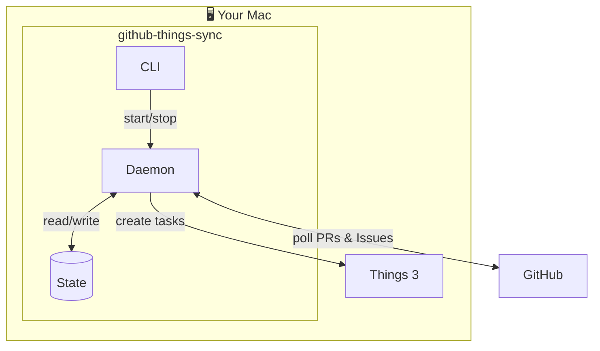
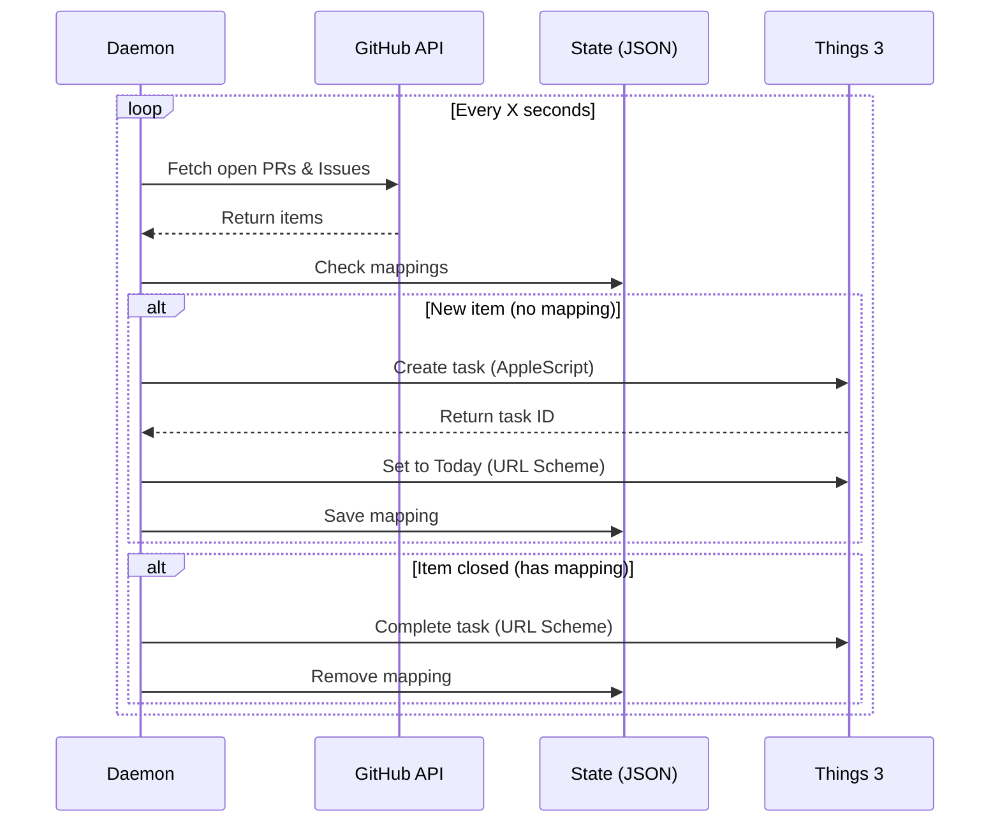

# Architecture

## Overview



## Data Flow



## How It Works

1. **Daemon polls GitHub** for your open PRs and Issues
2. **New items** → Creates task in Things via AppleScript (gets task ID) + sets to Today via URL Scheme
3. **Closed items** → Completes task in Things via URL Scheme
4. **State tracked** in `~/.github-things-sync/state.json` to avoid duplicates

## GitHub Queries

| Type | Query |
|------|-------|
| PR Review Requests | `is:pr is:open review-requested:@me` |
| Your PRs | `is:pr is:open author:@me` |
| Assigned Issues | `is:issue is:open assignee:@me` |
| Your Issues | `is:issue is:open author:@me` |

## Components

### CLI (`src/cli/`)
Entry point using [Commander.js](https://github.com/tj/commander.js).

### Daemon (`src/daemon/`)
Background process that polls GitHub and syncs to Things.

### GitHub Client (`src/github/`)
Uses [Octokit](https://github.com/octokit/octokit.js) for GitHub API.

### Things Client (`src/things/`)
Creates tasks via AppleScript (to get task ID) and URL Scheme (for updates).

### State (`src/state/`)
JSON-based persistence for config and task mappings.

## Sync Behavior

| You do in Things... | What happens on next sync? |
|---------------------|---------------------------|
| Complete a task | Nothing - your override is respected |
| Move task to another day | Nothing - sync doesn't touch scheduling |
| Delete a task | Nothing - mapping still exists, won't recreate |
| GitHub item closes | Task auto-completes in Things |

## Development

```bash
# Run in dev mode (TypeScript directly)
npm run dev -- init
npm run dev -- sync -v
npm run dev -- config --verify

# Build for production
npm run build

# Install globally
npm install -g .
```
